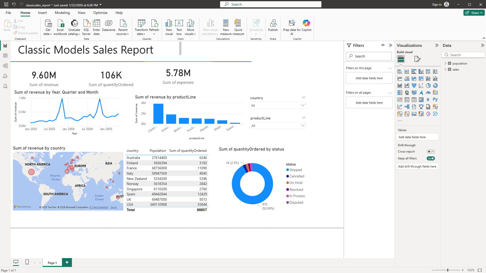

# Classic Models Sales Dashboard

## Overview
This Power BI project analyzes sales performance, revenue, expenses, and product categories using interactive dashboards.

## Features
- Revenue trends over time
- Product line comparison
- Sales by country
- Order status analysis
- Interactive filters

## Tools Used
- Power BI
- Excel
- Data Visualization

## Dashboard Preview

